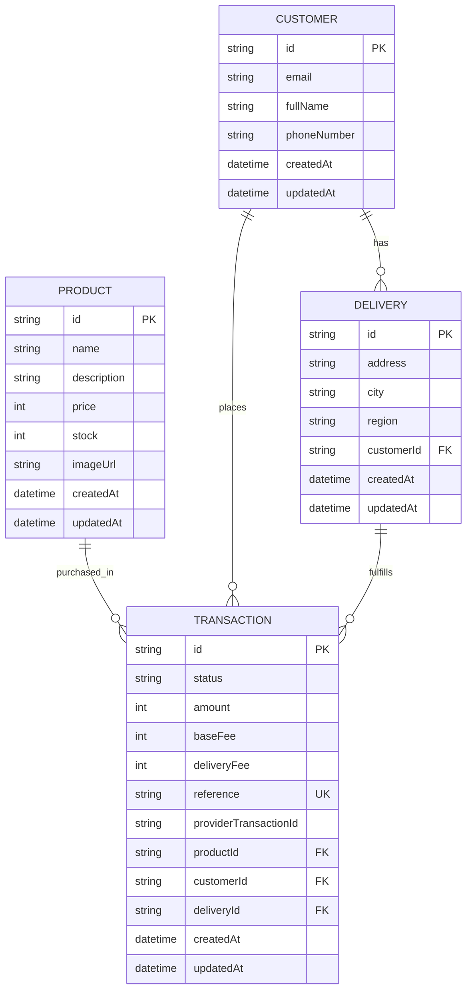

# Store Checkout API

Backend de checkout para catálogo, creación de pedidos y procesamiento de pago en entorno Sandbox. Está construido con NestJS, PostgreSQL, Prisma y una arquitectura de puertos y adaptadores.

## Requisitos

- Node.js 20 o superior
- npm
- Docker Desktop con Docker Compose

## Configuración local

1. Instalar dependencias:

   ```bash
   npm install
   ```

2. Crear el archivo local de variables desde la plantilla:

   ```powershell
   Copy-Item .env.example .env
   ```

   Configura la URL PostgreSQL y las credenciales Sandbox del procesador en `.env`. Nunca publiques este archivo ni incluyas secretos en la aplicación web.

3. Iniciar PostgreSQL y preparar el esquema/datos:

   ```bash
   docker compose up -d
   npx prisma db push
   npx prisma db seed
   ```

4. Iniciar el backend:

   ```bash
   npm run start:dev
   ```

   El API queda disponible en `http://localhost:3000`.

Para compilar y ejecutar en modo producción local:

```bash
npm run build
npm run start:prod
```

## Seguridad del API

- Helmet añade cabeceras HTTP de seguridad, incluida la política HSTS para clientes HTTPS.
- CORS sólo permite los orígenes de `CORS_ORIGINS`; configura aquí el origen del SPA desplegado.
- `express-rate-limit` limita el API a 120 solicitudes por minuto y el endpoint de pago a 8 por minuto por IP.
- `ValidationPipe` transforma DTO, elimina campos no declarados y rechaza propiedades adicionales.
- Las respuestas de transacciones usan `Cache-Control: no-store`.
- Los logs de pago no incluyen cuerpos/respuestas del proveedor ni mensajes de error que pudieran contener información sensible.
- `TRUST_PROXY=1` sólo debe habilitarse si la aplicación está detrás de un proxy inverso de confianza que sobrescriba `X-Forwarded-For`.
- En producción, publicar el API sólo tras HTTPS y almacenar secretos en el gestor de secretos del proveedor; nunca en el bundle del frontend.

## Modelo de datos

Los precios, tarifas y montos se guardan como enteros en centavos COP. El número de tarjeta y el CVC no forman parte del modelo ni se persisten en PostgreSQL.



El esquema ejecutable está en [prisma/schema.prisma](prisma/schema.prisma); los productos de demostración se cargan desde [prisma/seed.ts](prisma/seed.ts). `db push` y el seed están pensados para desarrollo/Sandbox.

## Contrato HTTP

Todas las rutas están bajo la raíz del API. Los DTO se validan con `class-validator`; campos desconocidos se descartan. Las respuestas usan JSON.

### `GET /products`

Lista los productos ordenados por fecha de creación ascendente.

Respuesta `200`:

```json
[
  {
    "id": "<product-id>",
    "name": "Audífonos Premium Inalámbricos",
    "description": "Audífonos con cancelación de ruido",
    "price": 29900000,
    "stock": 50,
    "imageUrl": "https://example.test/product.jpg",
    "createdAt": "2026-01-01T00:00:00.000Z",
    "updatedAt": "2026-01-01T00:00:00.000Z"
  }
]
```

`price` está expresado en centavos: `29900000` corresponde a `$299.000 COP`.

### `GET /products/:id`

Obtiene un producto por su identificador. Devuelve `404` si no existe.

### `POST /transactions`

Crea cliente, dirección de entrega y transacción `PENDING` en una transacción de base de datos. Rechaza productos inexistentes o sin stock (`400`). Las tarifas del backend son base `200000` centavos y envío `500000` centavos.

Cuerpo:

```json
{
  "productId": "<product-id>",
  "customerEmail": "ana@example.com",
  "customerFullName": "Ana García",
  "customerPhoneNumber": "3001234567",
  "deliveryAddress": "Calle 10 # 20-30",
  "deliveryCity": "Bogotá",
  "deliveryRegion": "Cundinamarca"
}
```

Respuesta `201` (valores ilustrativos):

```json
{
  "id": "<transaction-id>",
  "status": "PENDING",
  "amount": 29900000,
  "baseFee": 200000,
  "deliveryFee": 500000,
  "reference": "<generated-reference>",
  "productId": "<product-id>",
  "customerId": "<customer-id>",
  "deliveryId": "<delivery-id>",
  "createdAt": "2026-01-01T00:00:00.000Z",
  "updatedAt": "2026-01-01T00:00:00.000Z"
}
```

### `POST /transactions/payment`

Sólo acepta una transacción `PENDING`. Envía los datos de tarjeta al procesador desde el backend, tokeniza la tarjeta, crea la transacción de pago y actualiza el estado local. El inventario disminuye una unidad sólo cuando el resultado es `APPROVED`.

Cuerpo:

```json
{
  "transactionId": "<transaction-id>",
  "cardNumber": "4242424242424242",
  "cvc": "123",
  "expMonth": 12,
  "expYear": 28,
  "cardHolder": "ANA GARCIA"
}
```

Respuesta `201` contiene la transacción actualizada. Estados habituales: `APPROVED`, `DECLINED`, `PENDING` o `ERROR`. Errores de validación/proceso devuelven `400`.

> El ejemplo de tarjeta es un número de prueba y sólo debe usarse en Sandbox. No envíes credenciales privadas desde el navegador.

### `GET /transactions/:id`

Devuelve la transacción junto con `product`, `customer` y `delivery`. Devuelve `404` si no existe.

## Colección Postman

Importa [postman/checkout-api.postman_collection.json](postman/checkout-api.postman_collection.json). Define `baseUrl` como `http://localhost:3000`. La colección guarda `productId` y `transactionId` de las respuestas para encadenar los requests. El pago sólo es válido contra el entorno Sandbox.

## Pruebas y cobertura

```bash
npm test -- --runInBand
npm run test:cov -- --runInBand
```

Última validación local: **48 tests en 12 suites**; cobertura global backend: **84,54% statements, 81,05% branches, 95,74% functions y 85,50% lines**. Jest exige un umbral mínimo de 80% en las cuatro métricas.

## Arquitectura

- `domain`: entidades, errores y puertos.
- `application`: casos de uso; resultados de negocio representados con `neverthrow`.
- `infrastructure`: adaptadores Prisma y procesador de pago.
- `products/` y `transactions/`: composición de módulos Nest y controladores HTTP delgados.

## Alcance de despliegue

Esta guía cubre ejecución local y Sandbox. La publicación del API, base de datos y documentación pública requiere configurar infraestructura, HTTPS y secretos en el proveedor cloud elegido.
